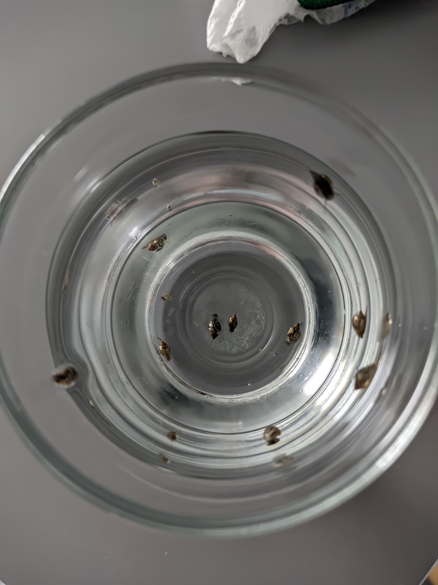

+++
title = "Kalandjaim a hólyagcsigákkal"
description = "Minden akvarista rémálma, főként a kezdőké"
date = 2022-12-01
updated = 2023-03-01
[taxonomies]
tags = ["akvárium", "történet"]
[extra]
banner = "banner.jpg"
+++

Idén végre beszereztük az akváriumot és nyáron el is indítottam. Csupán pár hónap telt el azóta és máris rengeteget tanultam és több dolog történt, amit nem gondoltam volna, hogy valaha megtapasztalok, lehet, jobb is lett volna, ha nem fordulnak elő.

Már több akadállyal is kellett szembesülnöm. Megküzdöttem az algásodással, sürgős vásárlás után végre megtaláltam azok ellenszerét. Ezután egy könyv segítségével rájöttem arra is, hogy a neonhalaim darakórosak, és gyors cselekedetekkel azt is sikerült kiírtanom az akváriumomban. Viszont augusztusban észrevettem aprócska pontokat az akvárium falán, a fán és a növényeken. Közelebbről megnézve, peték voltak.

Először egyáltalán nem gyanakodtam. Azt hittem, hogy a halak rakták, örültem is neki, kishalaim lesznek. Bárcsak így lett volna. 1-2 nappal később még több pete jelent meg mindenütt és nem sokkal később a peték eltűntek és furcsa kis csigák jelentek meg az akváriumban. Eleinte nem is gondoltam, mennyi lesz, de nem tartott sokáig, mire elkönyveltem, hogy ez így nem lesz jó.

Nem tudtam, pontosan honnan jöttek, először a sisakcsigáimra gyanakodtam, ezért ki is szedtem az egyiket az akváriumból. Utólag nézve ez egy elhamarkodott és igazságtalan döntés volt rá nézve, szegény nem érdemelte meg, hogy így végezze. (Szerencsére, a másik sisakcsigám azóta is él és virul.)

Gondolkoztam, hogyan lehetne megszabadulni tőlük, ezért elmentem ismét az akvarista szaküzletbe és ott a csigaevő csigákat ajánlották. Emlékszem, ahogy vittem haza a villamoson, a megállóban egy hölgy érdeklődött is irántuk, mit fogok a zacskóban. Gondoltam, mennyire ironikus, hogy csigák esznek csigákat.

Be is raktam őket, 4 csiga volt. Vártam, nem nagyon hittem az egészbe, látványosabb történésekre számítottam. 1-2 gyilkos csiga el is hullott az elején, gondoltam, remek, annyira nem voltak olcsók. Viszont napokkal később figyelmes lettem arra, hogy üres csigaházak vannak a talajon és azon belül. Örültem is, érdekes látvány volt.

Viszont nem voltam elégedett a tempóval, habár pár kis csigával kevesebb lett, azért még így is rengeteg maradt és néha petéket is láttam, ezért az egyik tisztításnál fogtam egy poharat és kézzel kiszedegettem a lehető legtöbb kis csigát, amit tudtam. Ez meglehetősen felgyorsította a folyamatot, innentől mindig, ha láttam egy újabb kis csigát, megfogtam és kiszedtem kézzel, egy sem menekülhetett.

<figure>

<figcaption>És ez még csak egy töredékük volt...</figcaption>
</figure>

Ugorjunk a jelenbe, pár hete arra lettem figyelmes, hogy egyáltalán nincsenek hólyagcsigák. Az egyik tisztítás során, mikor szétszedtem a szűrőt, hogy alaposan kipucoljam, találtam vagy 8-10 csigát a szűrőn belül, az egyik nagyobb is volt a többihez képest. A teóriám az, hogy ahhoz, hogy meneküljenek a csigaevő csigáktól, elrejtőztek a szűrőben, legalább 1-2 darab, valószínűleg az a nagyobbik, ott le is petézett, viszont megnőtt akkorára, hogy nem fért ki a lyukakon utána. Mindenesetre, alaposan átnéztem a szűrőt és meggyőződtem arról, hogy se pete, se csiga ne maradjon.

Ezzel lezárult a csigainváziós rémálom, mellyel szerintem minden akvarista összefut legalább egyszer. Őszintén, senkinek se kívánom.

**FRISSÍTÉS (2023. 03. 01.):** 1-2 csiga jelent meg még utána, de hamar megszabadultam tőlük, egy hónapja nem találkoztam újabbal, illetve azóta elpusztultak az utolsó gyilkos csigák is, valószínűleg éhen haltak szegények.

## Tanácsok magamnak (és másoknak) a jövőre nézve

- Új növényvásárlás után mindig győződj meg, hogy "mit viszel be" a növénnyel. Érdemes alaposan átnézni, nincs-e rajtuk hívatlan vendég.
- Ha olyan helyről veszed a növényt, érdemes már előtte beszerezni csigacsapdákat vagy csigaevő csigákat, a biztonság kedvéért.
- A csigaevő csigák vagy a csigacsapdák lehet jobb megoldások, mint a vegyszerek, melyek akár ártalmasak lehetnek a halakra. Érdemes szaküzletbe menni és ott is tanácsot kérni.
- Ezek a csigák eléggé gyorsan szaporodnak, azonban nem haszontalanok. A [Wikipédia](https://hu.wikipedia.org/wiki/T%C3%B6mzsi_h%C3%B3lyagcsiga) szerint megeszik a zöldalgákat, viszont tényleg érdemes mérlegelni, hogy akarunk velük elbánni, én azért nem hagynám legközelebb, hogy így elszaporodjanak, mert valljuk be, nem a legszebb teremtmények.
- Legközelebb, ha van valami újdonság, érdemes előtte rákeresni, mint feltételezni dolgokat, például ebben az esetben lehet, ha hamarabb rájövök, hogy a peték nem halaktól származnak, akkor hamarabb és könnyebben megfékezem az inváziót.

